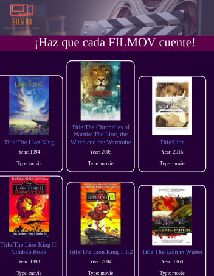
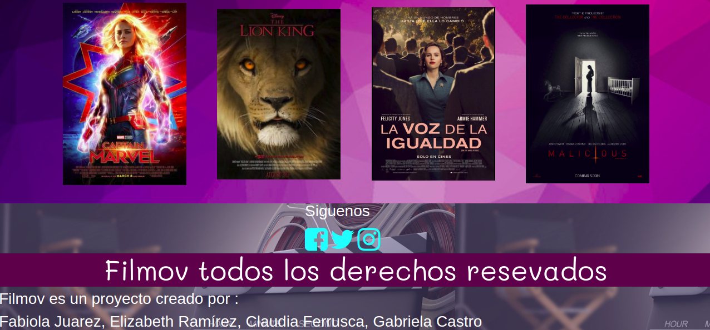
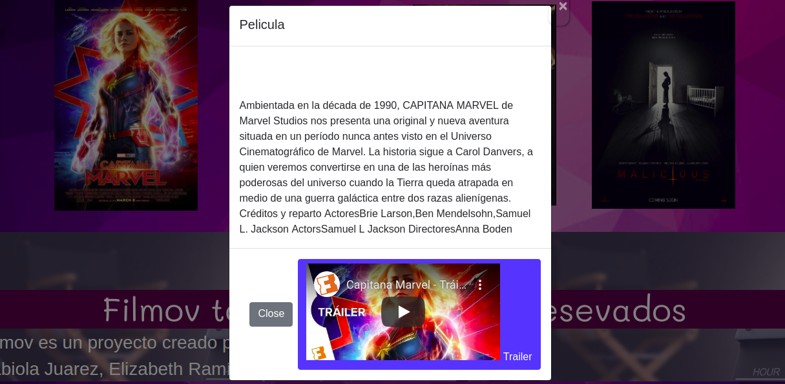
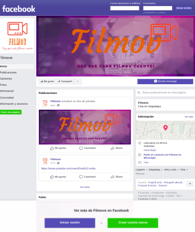
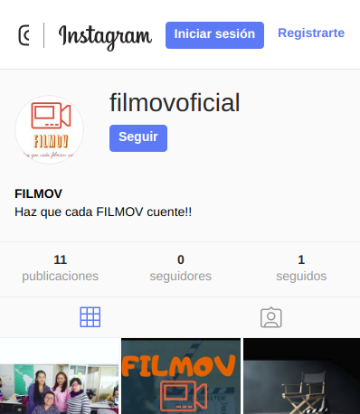
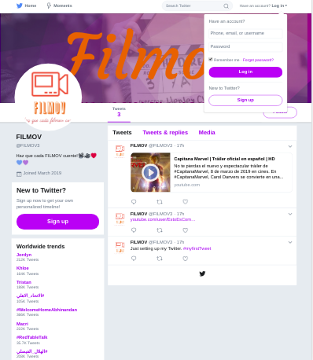
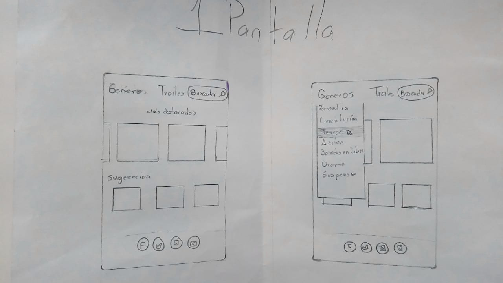
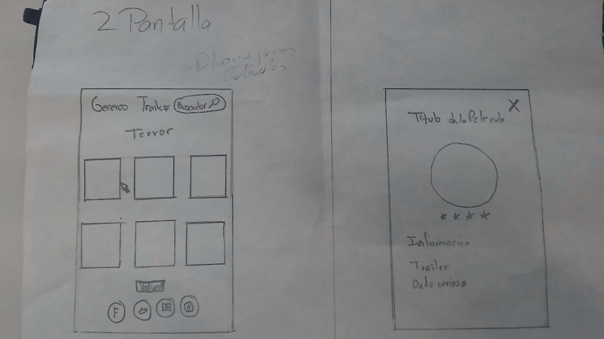
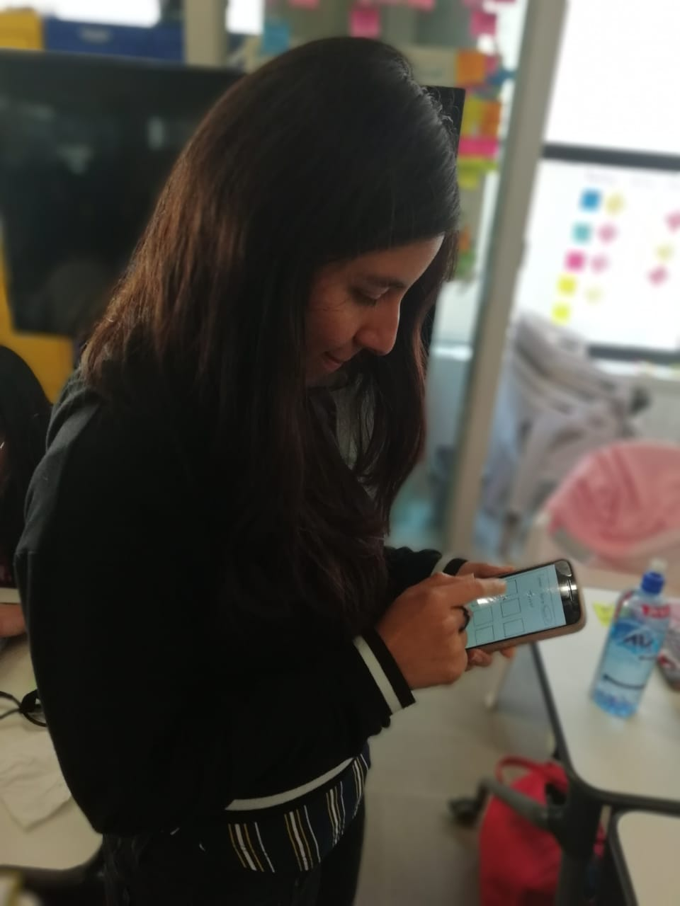
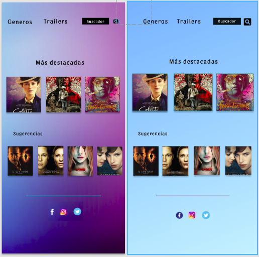

# HackatonMovies2019
## Índice del proyecto de pagina

- [Introducción](#Introducción)
- [Descripción](#Descripción-del-proyecto)
- [Comenzando](#Comenzando)
- [Pre-requisitos](#Pre-requisitos)
- [Instalación](#Instalación)
- [Construido con](#Construido-con)
- [Contribuyendo](#Contribuyendo)
- [Versionando](#Versionando)
- [Licencia](#Licencia)
- [Agradecimientos](#Agradecimientos)

## Introducción

 
 - 

- 

- 

- 

- 

- 

- 

FILMOV  que pretende crear una marca que tenga presencia no solo como pagina web, si no también en facebook, instagram, spotify, para todos aquellos amantes del cine. En FILMOV encontraran una gran opción para conocer mas sobre el septimo arte. 
A continuación una liga con la presentación: 

https://docs.google.com/presentation/d/1X7NTyY7tbkQPcTuxu6czD5NWHhaXZthenf3EdX-DsFQ/edit?usp=sharing

## Descripción

El producto "FILMOV", basado en la palabra Slovena para cine, es una pagina web donde el usuario puede elegir dentro de una base de datos de películas tomada de OMBD, para poder visualizar diversa información sobre estas, como por ejemplo año de estreno, genero, etc.
El usuario tiene la opción de buscar por categoría de genero o series a través de la barra de navegacion, acceder a trillers y redes sociales de la marca.

Para poder crear la idea de la pagina se entrevisto a 33 usuarios a travez de una encuesta en google forms:

https://docs.google.com/forms/d/1dFaupVF88PeY2AN9aaRE_K59DusnWDu1lK_CiUZDwkM/edit#responses

Gracias a sus respuestas determinamos las siguientes historias de usuario:

- Yo como usuario quiero ver la información de las peliculas disponibles, para poder elegir una.

- Yo como usuario quiero poder buscar las peliculas por genero, para facilitar mi elección.

- Yo como usuario quiero que la pagina me de sugerencias, para poder conocer nuevo material cinematografico.

- Yo como usuario quiero ver noticias y trailers.

- Yo como usuario yo como usuario quiero poder acceder a la comunidad y redes sociales de la pagina.

- Yo como usuario quiero una interfaz facil intuitiva y de buena calidad para poder acceder a la información.

Con los cuales se creo el siguiente prototipo en marvel:

Prototipo de baja fidelidad:

https://marvelapp.com/b382i0h/screen/53958338

Pruebas de usabilidad:

  

https://drive.google.com/drive/folders/1Gop_4UQoXJVb9OJigzLs3DZRvc1HSNzn

Prototipo de alta fidelidad:

https://www.figma.com/file/ZLusCo8kKgwfmSg3p4Y9QGMD/Untitled?node-id=10%3A4

Despues de las pruebas de usabilidad con el prototipo de alta fidelidad se encontraron los siguientes problemas:

- Los colores no eran los indicados para los usuarios, preferian colores oscuros
- La opcion de trailer no estaba bien ubicada
- Faltaba resaltar el menu de generos y buscador
- La segunda pagina que mostraba la información de la pelicula elegida necesitaba ser resaltada

## Comenzando

Este proyecto toma los datos de base de datos API se utilizo el editor de texto de Visual Studio Code, con en lenguaje JavaScript, sobre el marcador de texto HTML, con el lenguaje de diseño grafico CSS, usando bootstrap ; el repositorio original se creo en git hub. A continuación las especificaciones técnicas

## Pre requisitos

Para poder descargar y usar este repositorio se necesita tener:

- un editor de texto.
- una shell para interpretar líneas de comando 
- git

## Instalación 📦

Para poder usar el repositorio necesitas forquearlo (dando click donde dice fork) y despues clonarlo en la consola con :git clone + el url del repo.

## Construido con 

- GoogleForms 
- Marvel app
- figma
- Javascript
- Bootstrap
- HTML
- CSS
- Amor :)

## Contribuyendo

Se agradecerá toda contribución y comentarios a este proyecto.
Para ello necesitas:

- Tener una cuenta en git.

- Haciendo fork en el repositorio de git, clonandolo de manera local en tu pc.

- Crear un repositorio en la cuenta del Github 

## Versionando

El sistema de control de versiones en este caso es el de git que permite descargar el repositorio y las actualizaciones a traves de el comando git pull. Se recomienda numerar el versionado por si se quiere tener mayor orden sobre lo que se hace.

## Licencia

- Codigo abierto
- Datos tomados de http://www.omdbapi.com/

## Agradecimientos

A todo el equipo;

- Gabriela Castro
- Fabiola Juárez
- Claudia Ferrusca
- Elizabeth Ramírez

## Checklist

- [x] Toma datos de la API.
- [x] Busca peliculas por nombre. 
- [x] Busca peliculas por categoria.
- [x] Incluye _Definición del producto_ clara e informativa en `README.md`.
- [x] Incluye historias de usuario en `README.md`.
- [x] Incluye _sketch_ de la solución (prototipo de baja fidelidad) en
      `README.md`.
- [x] Incluye _Diseño de la Interfaz de Usuario_ (prototipo de alta fidelidad)
      en `README.md`.
- [x] Incluye el listado de problemas que se dectaron a través de tests de
      usabilidad en el `README.md`.
- [x] UI: Muestra datos en cards.
- [x] UI: Permite filtrar data en base a una condición.